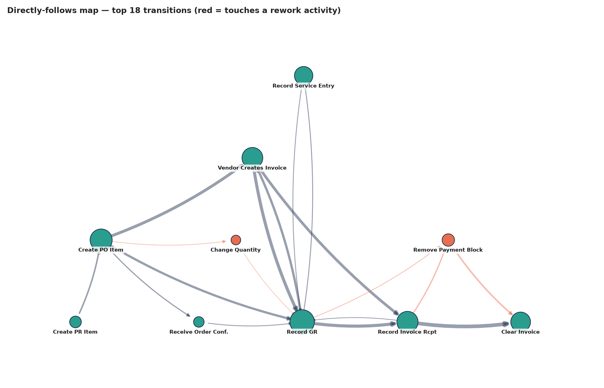
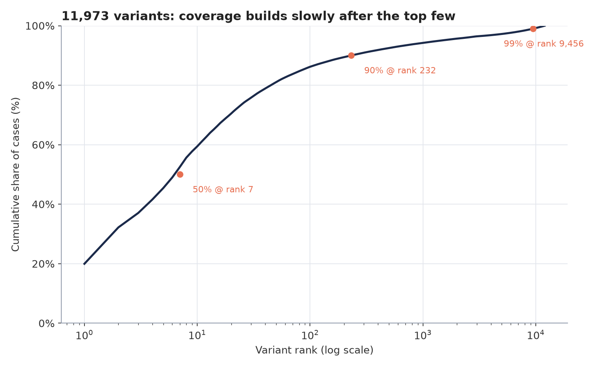
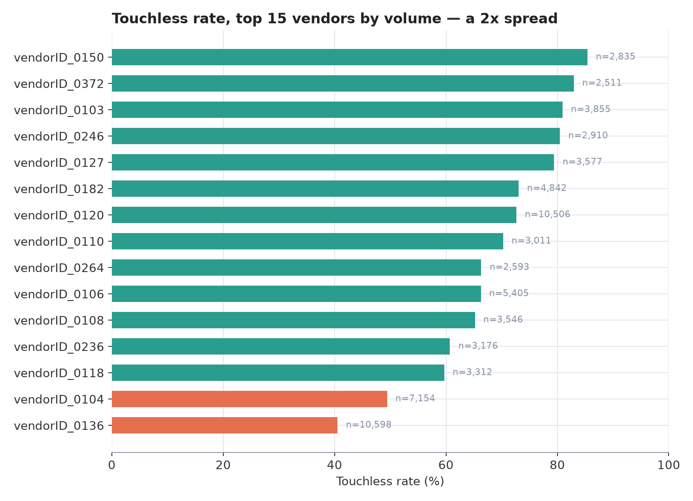
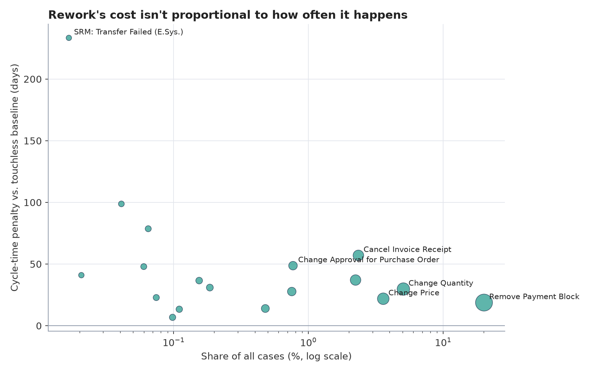

# P2P Process Mining 🔍

Process mining on a real purchase-to-pay event log: reconstructing how the
process actually ran, and quantifying where cycle time and rework go.

## Key findings

- Only **20.0%** of 251,734 cases follow the process's own most common path —
  the rest scatter across a tail of **11,973 variants**, three quarters of
  which occur exactly once.
- **63.2%** of completed cases run touchless (no rework) — but that number
  only holds up after a naive "no human touched it" definition returned a
  degenerate 0.0% and had to be rebuilt around what the activities actually
  mean, not who's attached to them.
- Rework adds a **19.6-day** median cycle-time penalty, and it's not evenly
  priced: the most common rework activity (`Remove Payment Block`, 22.2% of
  cases) is also one of the cheapest, while rare ones (SRM transfer failures,
  invoice cancellations) run 2–3x the touchless baseline.
- The one sequence rule the system actually enforces — invoice verification
  gated on goods receipt — holds with **zero exceptions** across 11,076
  comparable cases. The one that isn't enforced, a PO existing before the
  vendor's invoice, is violated in **1.6%** of cases: small, but the cleanest
  true control gap found in the whole log.

Each number below is reproducible from `data/*.parquet` with the script named
next to it — nothing here is manually computed.

## Data

[BPI Challenge 2019](https://data.4tu.nl/articles/dataset/BPI_Challenge_2019/12715853/1)
— SAP-derived purchase order handling from a multinational coatings company,
published for research. Not in git (695 MB); download the `.xes` into `data/`.

Verified on ingest against the published figures:

| | Expected | Parsed |
|---|---|---|
| Cases (PO line items) | 251,734 | 251,734 ✓ |
| Purchasing documents | 76,349 | 76,349 ✓ |
| Distinct activities | 42 | 42 ✓ |
| Events | >1.5M | 1,595,923 |

## What the log actually contains

Two things worth knowing before designing any analysis:

- **Effectively one company.** The dataset description mentions 60 subsidiaries,
  but the log holds 4 company IDs and 99.6% of cases sit under `companyID_0000`.
  Cross-subsidiary benchmarking is not available here.
- **Timestamps run 1948–2020** despite covering orders submitted in 2018. The
  outliers are data errors and need an explicit filter — their prevalence is
  itself a finding worth reporting rather than quietly dropping.

Dimensions that do carry signal:

- `item_category` — the match type (`3-way match, invoice before GR` is 87.8%)
- `user` — `batch_*` identifies automated steps, so the touchless rate is
  directly measurable rather than estimated (9.8% of events are batch)
- `Remove Payment Block` fires 57,136 times — a rework loop visible in the raw
  activity counts before any mining

## Setup

    python3 -m venv .venv
    .venv/bin/pip install -r requirements.txt
    .venv/bin/python src/ingest.py

Ingest streams the XES with `iterparse` (memory stays flat) into two Parquet
tables — `data/cases.parquet` and `data/events.parquet`. Takes ~22s.

## Stack

- **duckdb** — every query below is SQL over the Parquet files directly, no
  database server, no loading step
- **polars** — result handling and the couple of places a dataframe is more
  natural than another query
- **matplotlib + networkx** — the four charts in `assets/`, including the
  directly-follows process map (`src/charts.py`)

## Analysis

Four scripts, each independent, each reading straight from the Parquet
tables. Run in order or standalone — `src/charts.py` last, since it plots the
other four's output.

1. **Variant analysis** ✓ — the happy path against the long tail; what share of
   cases follow the designed process at all. `src/variants.py` →
   `output/variants.parquet`. See findings below.
2. **Touchless rate** ✓ — cases completing PO → GR → invoice → payment with no
   rework, split by match type and vendor. `src/touchless.py` →
   `output/touchless_cases.parquet`. See findings below.
3. **Rework cost** ✓ — frequency of post-approval changes and payment blocks,
   and the cycle-time penalty attached to them. `src/rework.py` →
   `output/rework_cases.parquet`. See findings below.
4. **Sequence violations** ✓ — invoice before goods receipt, PO raised after
   the invoice arrived (maverick buying), and their control implications.
   `src/sequence_violations.py` → `output/sequence_cases.parquet`. See
   findings below.

### 1. Variant analysis — findings

A variant is a case's ordered sequence of activities. No "designed" path was
assumed up front — the most frequent variant defines the happy path
empirically, and everything else is deviation from it.

| | |
|---|---|
| Distinct variants | 11,973 |
| Cases on the single most common variant | 50,286 (**20.0%**) |
| Variants needed for 50% of cases | 7 |
| Variants needed for 90% of cases | 232 |
| Variants needed for 99% of cases | 9,456 |
| Singleton variants (1 case each) | 9,030 (75.4% of all variants, 3.6% of cases) |

Only one in five cases follows the process's own most common path — the
remaining 80% is spread across a tail almost 12,000 variants long, three
quarters of which occur exactly once. That tail is the real shape of the
process; the "happy path" is a minority case.

The top two variants are close in frequency but differ in a way that matters:

| Rank | Share | Sequence |
|---|---|---|
| 1 | 20.0% | Create PO Item → **Vendor creates invoice** → **Record GR** → Record Invoice Receipt → Clear Invoice |
| 2 | 12.2% | Create PO Item → **Record GR** → **Vendor creates invoice** → Record Invoice Receipt → Clear Invoice |

Rank 1 records the invoice before the goods receipt; rank 2 does it the other
way round. Together they're 32.2% of all cases, and the split is really a
preview of analysis step 4 (sequence violations) — whether "invoice before
GR" counts as a control violation or as a legitimate second happy path
depends on `gr_based_inv_verif` at the case level, not on variant frequency
alone.

Also visible in the top 10: `Remove Payment Block` shows up in several
variants (rank 4, 7, and 8 — 3.2–4.5% of cases each), i.e. rework is common
enough to form its own recognizable variants rather than being rare noise.

### 2. Touchless rate — findings

First definition tried — "no event in the case has a human (`user_*`)
resource" — was degenerate: 92% of `Create Purchase Order Item` events alone
carry a human user, since a buyer has to click "create" even on the most
routine order. That gives a touchless rate of **0.0%** and measures nothing;
resource type isn't the right signal.

Used instead: split the 42 activities into the expected PO-to-pay flow
(create → approve → receive → invoice → clear, including SRM's normal state
transitions) and everything that only fires on deviation (payment blocks,
cancellations, quantity/price/approval changes, subsequent invoices, debit
memos, SRM exception states — full list in `src/touchless.py`). A case is
touchless if it's **complete** (reaches `Clear Invoice`) and never fires a
rework activity.

| | |
|---|---|
| Cases reaching `Clear Invoice` (complete) | 183,677 (73.0%) |
| Touchless of complete cases (the STP rate) | 116,174 (**63.2%**) |

By match type (`item_category`), completed cases only:

| Match type | n | Touchless rate |
|---|---|---|
| 3-way match, invoice before GR | 173,698 | 63.4% |
| 3-way match, invoice after GR | 9,676 | 63.4% |
| 2-way match | 303 | 0.0% |

The 2-way match row isn't a real finding — it's an artifact of the
definition. All 303 of those cases fire `Change Approval for Purchase Order`,
which the rework list treats as a deviation everywhere else, but for 2-way
match it looks structural (100% incidence on a tiny n), i.e. a mandatory
approval step for that match type rather than an exception. Worth a per-type
rework list if this path gets pursued further; flagged here rather than
quietly folded into the headline number.

By vendor (top 10 by completed-case volume), touchless rate ranges from
**40.5%** (vendorID_0136, n=10,598) to **80.9%** (vendorID_0103, n=3,855) — a
2x spread among high-volume vendors, suggesting the rework rate is at least
partly a vendor-data-quality problem, not just a process-design one.

### 3. Rework cost — findings

Reuses the rework-activity list from step 2. Cycle time is `max(timestamp) -
min(timestamp)` per case; only **completed** cases are used (an in-flight
case's duration is censored, not real), and 260 of those are additionally
dropped for a corrupt timestamp (the 1948/1993/2001/2008/2020 sentinel dates
— see [What the log actually contains](#what-the-log-actually-contains)).
That leaves 183,417 cases for the duration analysis.

**How often, by activity** (share of all 251,734 cases):

| Activity | Cases | Share |
|---|---|---|
| Remove Payment Block | 55,839 | 22.2% |
| Change Quantity | 17,590 | 7.0% |
| Change Price | 11,224 | 4.5% |
| Delete Purchase Order Item | 8,839 | 3.5% |
| Cancel Invoice Receipt | 6,471 | 2.6% |
| Vendor creates debit memo | 5,988 | 2.4% |
| Change Approval for Purchase Order | 4,377 | 1.7% |
| *(17 more, each <1.2%)* | | |
| **Any rework activity** | **90,339** | **35.9%** |

**What it costs** (median cycle time, completed + clean-timestamp cases):

| | n | Median | Mean | p90 |
|---|---|---|---|---|
| Touchless | 116,012 | 71.3d | 76.1d | 120.1d |
| Reworked | 67,405 | 90.9d | 96.6d | 149.0d |

Rework adds a **19.6-day** median penalty — roughly 27% longer than the
touchless baseline. The first pass at "which rework type costs the most"
picked five activities by eye; extending that to *all* eighteen rework
activities with at least 30 comparable cases changes the story:

| Rework activity | n | Median | vs. touchless |
|---|---|---|---|
| *(touchless baseline)* | 116,012 | 71.3d | — |
| SRM: Transfer Failed (E.Sys.) | 42 | 304.7d | +233.4d |
| SRM: Deleted | 103 | 170.1d | +98.8d |
| Block Purchase Order Item | 163 | 149.9d | +78.7d |
| Cancel Invoice Receipt | 5,909 | 128.3d | +57.1d |
| Change Approval for Purchase Order | 1,933 | 120.0d | +48.7d |
| Change Quantity | 12,742 | 101.0d | +29.8d |
| Change Price | 9,036 | 93.2d | +21.9d |
| Remove Payment Block | 50,522 | 90.1d | +18.8d |
| *(10 more, each n<400 or delta<+15d)* | | | |

The most expensive activities by far — SRM transfer failures, deleted SRM
documents, blocked POs — are also the rarest (n=42–163), so treat their exact
multiples with caution; what's robust is the *direction*: the high-volume
rework paths (`Remove Payment Block`, `Change Price`, `Change Quantity`,
50,000+ and 9,000–13,000 cases respectively) are consistently the cheapest
per case, while low-volume exception paths run 2–4x more expensive. There's
no visible correlation between how often a rework activity fires and what it
costs — frequency and cost are two separate levers, not one.

**By vendor** (top 15 by completed-case volume, min. 200 cases): rework rate
ranges from 14.6% to 59.5%, but the cycle-time *penalty* when rework does
happen is mostly flat (0–12 days) — with one outlier: `vendorID_0127` has a
middling 20.6% rework rate but a **47.2-day** penalty, more than double any
other vendor in the top 15. A below-average frequency of rework that costs
far more than everyone else's when it does happen is a different problem
than the high-frequency/low-cost pattern above, and points at this specific
vendor relationship rather than the process design. Full table in
`output/rework_by_vendor.parquet`.

### 4. Sequence violations — findings

First cut compared `item_category`'s label ("invoice before GR" / "invoice
after GR") directly to actual event order and called any mismatch a
violation — 91.8% of "invoice before GR" cases came up violating, which is
implausible for what's supposedly the norm case. Checking `item_category`
against the case-level `gr_based_inv_verif` flag showed they're a 1:1
encoding of the same thing:

    invoice before GR  <=>  gr_based_inv_verif = false
    invoice after GR   <=>  gr_based_inv_verif = true

So the field is a **system control setting** — whether invoice verification
is gated on goods receipt — not a claim about when the vendor's invoice
happens to arrive. Only `gr_based_inv_verif = true` cases have an actual rule
that can be broken; `gr_based_inv_verif = false` cases have no such rule, so
an invoice recorded before GR there is normal operation, not a violation.

**Control check** — does `Record Invoice Receipt` ever precede
`Record Goods Receipt` when the system requires GR first (`gr_based_inv_verif
= true`)?

| | |
|---|---|
| Comparable cases | 11,076 |
| Violations | **0** (0.00%) |

The control holds without a single exception in the log. That's a genuine
finding, not a null result — worth stating plainly rather than skipped for
being "boring."

**Descriptive cross-check** (not a violation, since `gr_based_inv_verif =
false` imposes no order): across both 3-way-match categories, how often does
the vendor's invoice (`Vendor creates invoice`, an event SAP doesn't control)
arrive before goods receipt is recorded?

| | |
|---|---|
| Comparable cases | 208,701 |
| Invoice arrives first | 127,488 (61.1%) |
| GR recorded first | 81,213 (38.9%) |

This lines up with the variant analysis: the top two variants differ on
exactly this order and split roughly 62:38 across all 251,734 cases (20.0%
vs. 12.2%) — independent confirmation from a completely different query.

**Maverick buying** — `Create Purchase Order Item` after the vendor's invoice
already existed:

| | |
|---|---|
| Comparable cases | 209,686 |
| Maverick cases | 3,444 (**1.6%**) |
| Median delay | PO raised 11.5 days after the invoice already existed |

Unlike the GR/invoice ordering, no policy field makes this acceptable — a PO
created after the invoice means the purchase was already made, and the PO
exists only to get the invoice paid. 1.6% is small next to the 35.9% rework
rate from step 3, but it's the cleanest true control violation found across
all four steps: uncontested, well-defined, and directly actionable (a hard
block on invoice creation without a prior open PO would eliminate it).

## Layout

    src/ingest.py               XES → Parquet
    src/variants.py             variant analysis (step 1)
    src/touchless.py            touchless rate (step 2)
    src/rework.py               rework cost (step 3)
    src/sequence_violations.py  sequence violations (step 4)
    src/charts.py               the four PNGs in assets/, from steps 1-4's output
    notebooks/                  exploratory analysis
    data/                       raw log + derived tables (gitignored)
    output/                     per-step parquet exports (gitignored, regenerated by src/*.py)
    assets/                     charts embedded in this README (tracked)

---

Built by [Moritz Richter](https://www.linkedin.com/in/moritz-richter-28297119a/) · Finance & Strategy Consultant · Zürich
